# Smart City Application Manual

# 1. Introduction

Since this century, half of the population in the world live in urban areas compare with 15% that live in cities one hundred year ago. 
The increase in the world’s urban population, from two hundred million to almost 3 billion in only one hundred years is a clear indication of a lot of people moving from rural areas to urban centers and also an increase in the number of people born in cities.  
If we combine this data with the fact that the area that is urban have only grown to the 2.8% of the total land area of Earth it is a clear indication of overpopulation in several cities.
Usually, many ecosystems in and around urban areas are more biodiverse than rural monocultures, however, as cities grow in size, they start suffering from increased congestion, higher crime rates, and air pollution.
Usually cities suffer to manage energy, mobility, environment, services, waste, living places, logistic health, security etc. 
The financial and human resources needed to support cities are immense.

## 1.1 Audience
This document is mainly intented for:

* Developers and Operators interested into deploy FIWARE Smart mobility applications in a specific city. 

* Developers interested into adopting FIWARE or contributing to the initiative.

=================================================================================

# 2. Smart mobility application: Green Route

The application developed in the Smart City domain (called Green Route) is focused on supporting the citizen mobility in high polluted cities, like Mexico City, with the aim of improving the life quality of citizens and fostering environmental friendly behaviors by citizens. 
The objective of Green Route is to help the final user to determine the best route to follow to reach a destination, taking into account the user profile (such as health conditions), and the user preferences, such as transport type. 

## 2.1 Overview

* Green Route has been developed as an application for supporting the citizen mobility in high polluted cities, like Mexico City, with the aim of improving the life quality of citizens and fostering environmental friendly behaviours by citizens.

* This application joined information of air quality monitoring units from government and the units developed in the project. Also it is the fist time, in México City that this information is combined with the data of routes of public transport.

* The application was developed using the following technologies: Angular 2.0, HTML 5.0, Java, Bootstrap, and TypeScript. This enable the system to be used in Web and mobile platforms.

## 2.2 Data sources

* Air quality data from 47 fixed stations of Mexico City. 
The data are obtained from a crawler that obtained the data each hour.

* Air quality data from Murcia, Spain. The data are monitored through of a Smart Spot
[SmartSDK IoT](https://smartsdk.eu/wp-content/uploads/sites/8/2017/06/SmartSDK_D3.2v1.2_FINAL.pdf).

* Weather conditions from Mexico City. The data are monitored through of a Cloudino
 [SmartSDK IoT](https://smartsdk.eu/wp-content/uploads/sites/8/2017/06/SmartSDK_D3.2v1.2_FINAL.pdf).

* For obtaing the data from public transport services of Mexico City, Green Route obtained data from 
TransitFeeds web site. This site publish public transport data (agencies, routes, stops, trips and frequencies) in 
[GTFS format](https://developers.google.com/transit/).

* The revolutionary concept of human-as-a-sensor is a key element of Green Route. 
The users send an assortment of alerts such as accidents, traffic jams, pollution, etc. 
In this way, the alerts generated by users are a data source for Green Route.

* Also a NGSI component has been developed to communicate context data to the Orion Context Broker, which is the FIWARE 
component the centralize the context information.

=================================================================================

# 3. Application Walkthrough

The application developed in the Smart City domain (called Green Route) will focus on supporting the citizen mobility in high polluted cities, like Mexico City, with the aim of improving the life quality of citizens and fostering environmental friendly behaviours by citizens. 
The end-user perspective is shortly summarised below.
The objective of Green Route is to help the final user to determine the best route to follow to reach a destination, taking into account the user profile (such as health conditions), and the user preferences, such as transport type. 
Green Route proposes the ideal route for the user, avoiding routes with high levels of pollution, traffic jam or pollen, etc., allowing for instance, to obtain the preferred routes for people with respiratory diseases.

## 3.1 Application obtaining

We have a set of beacons configured to broadcast the URL of a light web page with information about Green Route.
In the case where the user has the Physical Web activated in her/his smartphone, then the user will receive a 
notification in his notification trays.

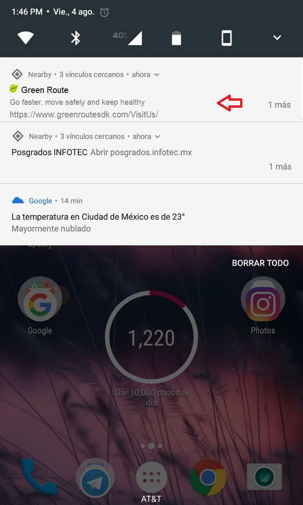

Doing click in "Visitu Us"  the user is redirected to the Sign up Green Route site.

## 3.2 Sign up
To start using the Green Route application, it is necessary to register. 
The URL to register is [www.greenroutesdk.com/#/signup](http://207.249.127.124/#/signup). 
In this view, the user must indicate simple information: an email and password. 
The user should be careful with email indicated, becuase in this email the user will be receive a token to access to Green Route. 

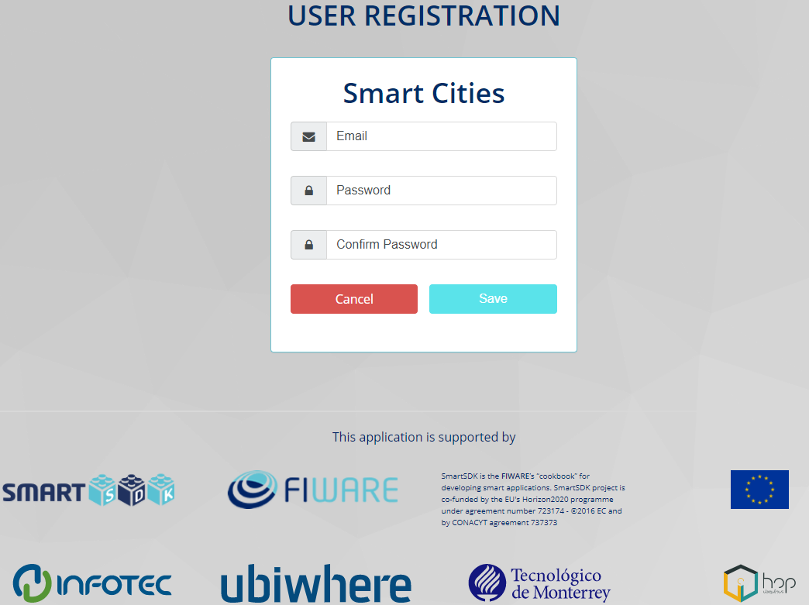

#### 3.2.1 Sign In
Once time that a user is registered can access to Green Route. 
The URL to access is [www.greenroutesdk.com/#/login](http://207.249.127.124/#/login). 
The user must use the same email and password registered previously.

Green Route makes a set of validations, such as indicate that the email and password are required to Sing In.

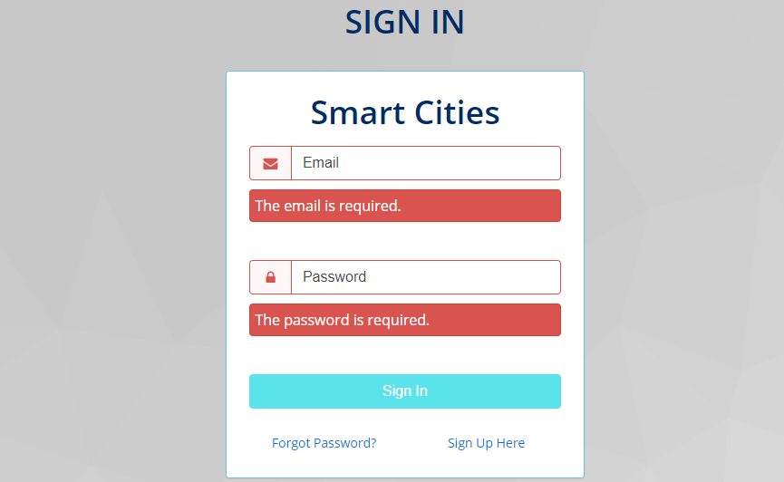

On the other hand, Green Route detected when a username or password is invalid.

#### 3.2.2 Forgot password
When a user forgot the password, it is easy to reset it. 
In the same view to "Sign In", the user can see the option "Forgot password". Also, the URL to find this option is 
[www.greenroutesdk.com/#/forgot-password](http://207.249.127.124/#/forgot-password).  User should write the
 email registered previously and press send button. Then, user will received an email with the  instructions to 
 reset the password.

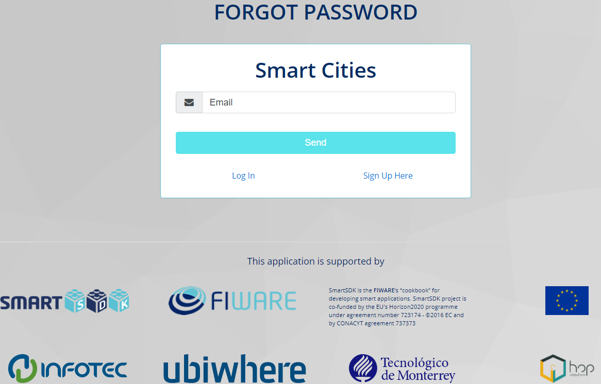

#### 3.2.3 Change your password
To change the password, the user should sign in to Green Route. 
Then, in the top right corner, the user can see a button with the name registered previously. 
Then user should press this option and a new menu will be displayed. 
After that, to change the password the options are: Settings / Change your password. 
Green Route shows the email registered, and to change the password, the user must write: the old password and a new password. 
Then user should confirm and save the changes. 
In order to see the changes, the user should close and start again the session using the new password.

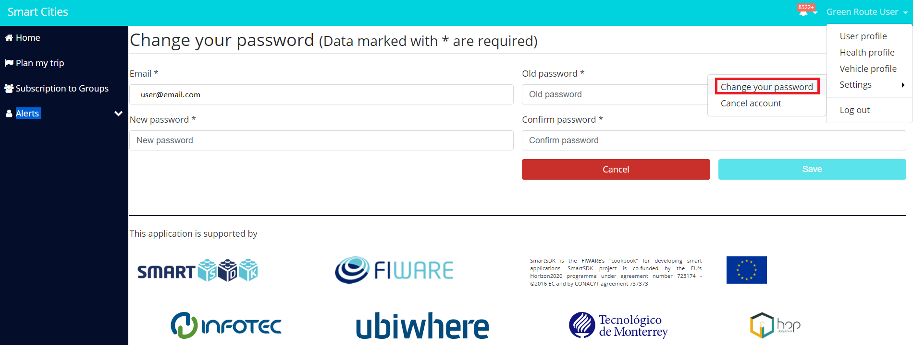

#### 3.2.4 Cancel account
If a user want to cancel the account should access to Settings / Cancel Account. 
It is important to mentioned that to cancel an account implies delete all the data. 
This action is permanent.

#### 3.2.5 Log out
For closing Green Route, user should press the button "Log out".

---
## 3.3 User personal profile

#### 3.3.1 Home

The Home option presents a general overview of the functionalities of the application: Smart Routes, Smart Healthcare, and Smart Points. 
When a user click on "Home" from any options always be redirected to this view.

#### 3.3.2 Register / edit personal profile

In this option, it is shows the information of user: name, family name, birth date and gender. 
Moreover, the data in the name´s field is the information that will be appear as user name on top right corner of Green Route.

#### 3.3.3 Personal address

Green Route can help you to determine the best route to follow to reach a destination.
A user could add some favorite addresses to generate in a simple way a route, for instance to your work or home.
In this same view, a user can see the addresses added. In addition, a user can edit o delete an address.
For adding address, press the "Add address" button on User profile menu.

In the new view, the user could add data, such as: country, region, locality, postal code, and so on. 
And the user could indicate the address type (home, work) or if it is favorite or not.

---

## 3.4 Health profile

#### 3.4.1 Register / edit health profile

The objective of Green Route is to help the final user to determine the best route to follow to reach a destination, taking into account your health condition. 
In this menu, the user has three options to indicate: the health state, the allergy symptoms or asthma level.

For allergy option, Green Route presents a set of symptoms. 
A user could indicate the symptomatology that presents durant an allergy. 
This information could be used to optimize the generation of routes.

For asthma option, Green Route presents four levels of asthma: Mild intermittent asthma, Mild persistent asthma, Moderate persistent asthma and Severe persistent asthma.
 

---

## 3.5 Vehicle profile

#### 3.5.1 Register /edit means of transport

A user could add information of means of transport that usually use to move it inside the city. 
In this option, Green Route shows a list with the vehicles added. 
A user can edit or delete a vehicle.
For adding a new vehicle, a user should press the add button. 

In the new view, the user could add data about vehicle type, fuel type, brand name, plate and so on. 
In addition, the user could indicate if the vehicle added is favorite or not.

-----
## 3.6 Subscriptions to groups

#### 3.6.1 Subscriptions
A user can received real time alerts from weather conditions, pollution, traffic, and so on from other users. 
In order to receive alerts, the use should subscribe to one group or groups, according his preferences.
For default, a set of groups has been created. 
Each group notifies different alerts. 
For instance, the "Forecaster group" notifies related to weather conditions alerts.
While, the "Green users group" notifies related to pollution.
On the other hand, the "Bikers group" notifies related to traffic jam, accidents and weather conditions.
Other current groups are: runners / walkers, drivers, public transport users and users with respiratory illness. 

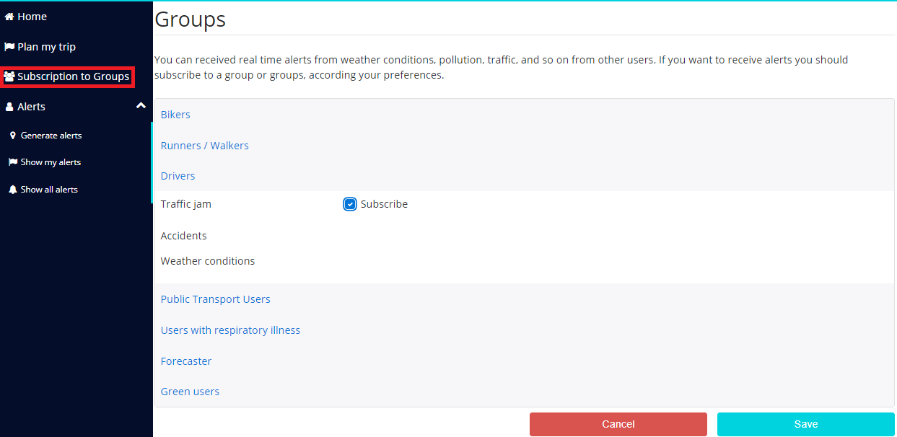

If a user wants to unsubscribe of a group, the user only should disable the button, as appears to following.

------------------------------------------

## 3.7 Alerts

#### 3.7.1 Generate alerts
Currently, there are two applications, firstly it is Green Route and secondly is the Alerts application. 
We are working to integrated both applications on Green Route. The alerts application aims is that a user can generate
alerts of different types. For instance, alerts of traffic jam, accidents, weather conditions, pollutions, pollen and asthma attacks.
In the left side of Green Route, the menu "Alerts" is shown and it displays the option of "Generate alerts". This option
send to the following URL: [https://www.smartsdkitesm.com](https://www.smartsdkitesm.com). 

Using the GPS function of the user´s smartphone, a map will be shown with the current location. 
Then a set of alerts and types alerts is shown. 
The user should press the alert icon that want to generate.
In addition, the user could add additional information related to the generated alert.

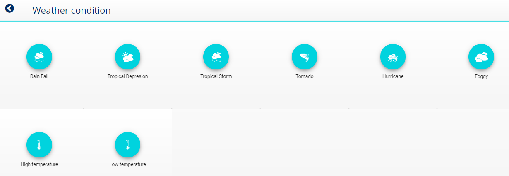

#### 3.7.2 Show my alerts
Following with Green Route functionalities, according the generated alerts, the user can see all the alerts that he has 
generated. Also, the user can filter the alerts according the alert type. Moreover, user can apply filters for alert subtype 
and date.

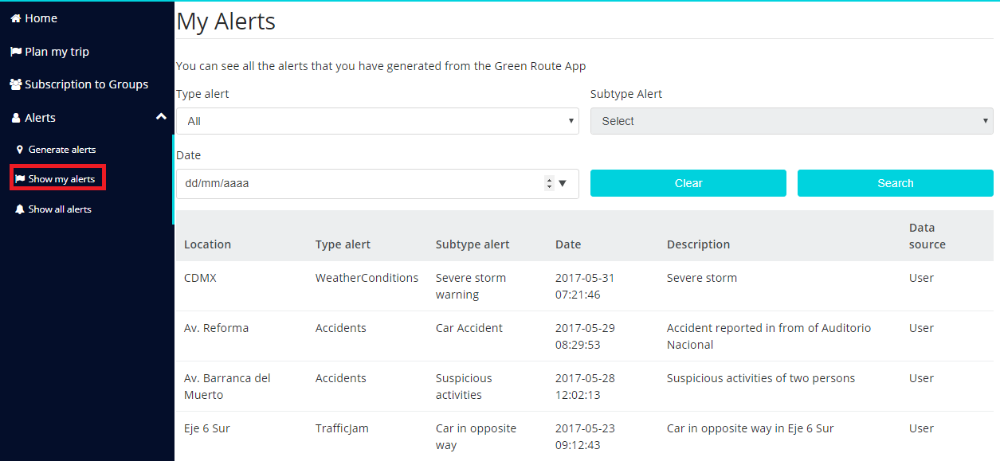

#### 3.7.3 Show all alerts

While that "Show my alerts" shows the alerts that the user generated, 
on the other hand "Show all alerts" shows all the alerts generated by all users from Green Route. 
The alerts shown corresponding to the groups that the user is subscribed. 
It is important to be subscribed at least to one group to receive alerts.
In this view, the alerts could filter by type and subtype alert. 
Green Route shows the location, type alert, subtype alert, date, description, and data source of the alert.
Currently, for weather conditions, the data sources of Green Route are: 
47 Monitoring Air Quality Stations of Mexico City and 2 IoT Components: Smart Spot and Cloudino 
[SmartSDK IoT](https://smartsdk.eu/wp-content/uploads/sites/8/2017/06/SmartSDK_D3.2v1.2_FINAL.pdf).

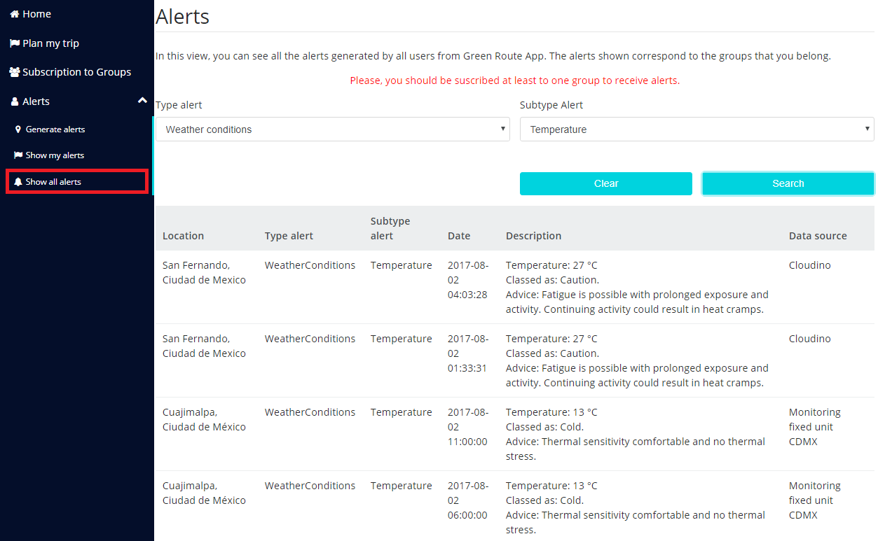

Furthermore, Green Route shows the number notifications for alert type, the icon is a bell. 
The user can press the button "View all" and he will be send to option "Show all alert".

---
## 3.8 Plan my trip

#### 3.8.1 Air quality monitoring units
Green Route monitors the Air Quality of Mexico City. Currently, for weather conditions, the data sources of Green Route are: 
47 Monitoring Air Quality Stations of Mexico City and 2 IoT Components: Smart Spot and Cloudino 
[SmartSDK IoT](https://smartsdk.eu/wp-content/uploads/sites/8/2017/06/SmartSDK_D3.2v1.2_FINAL.pdf). 
All these data sources are shown on map. 

Moreover, Green Route calculates the Air Quality Index. For calculating the Air Quality Index, Green Routes is based on 
EPA [United States Environmental Protection Agency](https://www.epa.gov/). According the air quality index will be the 
color of the station. For instance, if the air quality is satisfactory, the color will be green. 
If the air quality is acceptable, the color will be yellow, and so on.

Each station shows the station name, updated date, and air quality index, and so on.
In addition, each station also shows temperature, relative humidity, and gases values (PM10, SO2, NO2, O3, CO).  

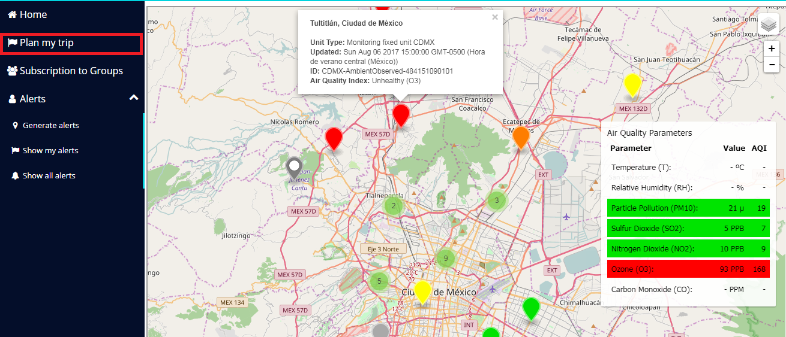

Related to data sources, the Cloudino and Smart Spot are shown on map in gray color. Currently, both sources monitor
temperature and relative humidity. 

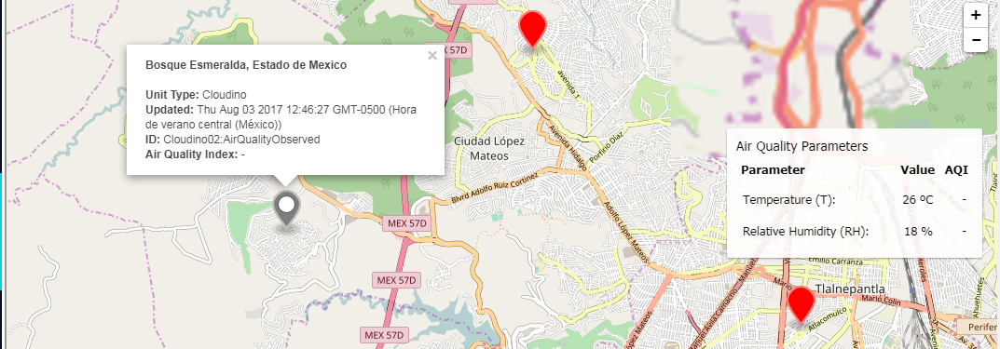

It is important to comment that Smart Spot monitors the temperature and relative humidity of Murcia, Spain. 
These data are shown on map too.

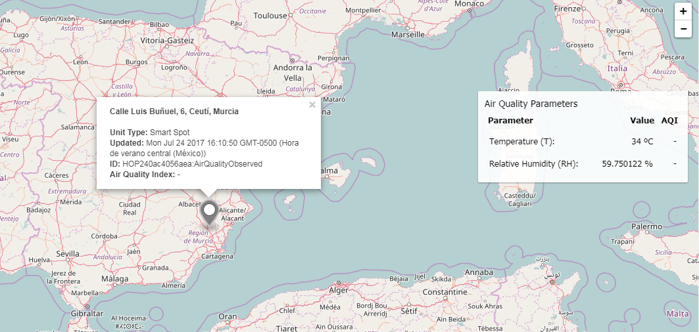

#### 3.8.2 Routing

Green Route allows calculating the best route between two points using public transportation. 

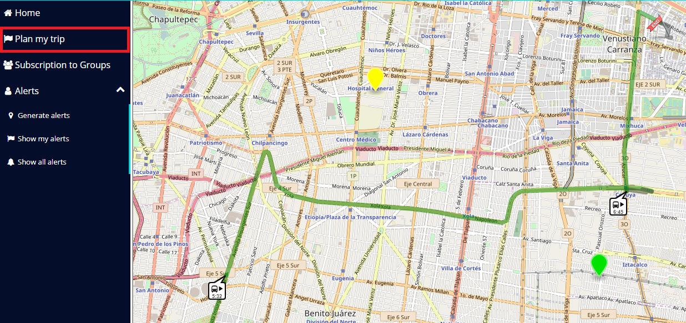

The route engine allows specifying several parameters regarding the route, like departure and arrival times,
maximum walking distance and others.

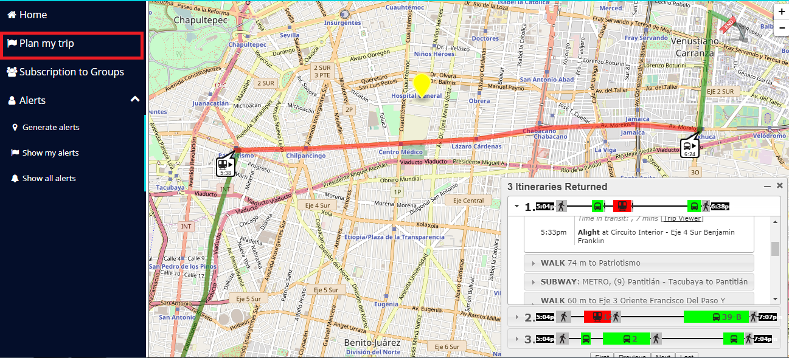

Regarding  the  calculated  route,  the  routing  engine  returns  the  possible  itineraries 
found and all the steps that the user needs to follow in each one. These steps refer to 
transportation changes (the calculated route can involve various transport types and 
services),  line  changes  and  others.  It  also  returns  the  route’s  polygon  in  a  polyline 
format and the total distance travelled.  

---
# 4. Installation & Administration Manual

For managing the application, it is necessary has some of following profiles: super-user, public transport manager or manager. 
All the previous functionalities are shown for final users and managers also.

## 4.1 Manage Green Route

### 4.1.1 Groups
For creating new groups to receive alerts, only the super-user has enabled this functionality. 
While the manager can edit and update the groups.
Some functionalities in this option are: searches, creates, edits, deletes and updates groups.

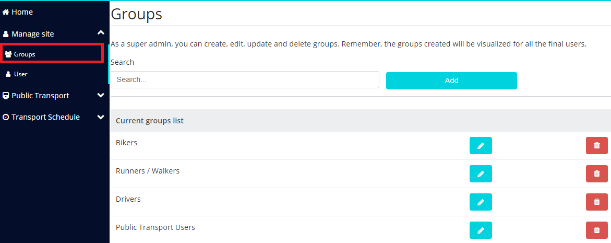

---
## 4.2 User manager tray component
Green Route allows to create a new users: final users, public transport manager or manager. This functionality is enabled
for super-user profile.
Some functionalities in this option are: searches, creates, edits, deletes and updates users.

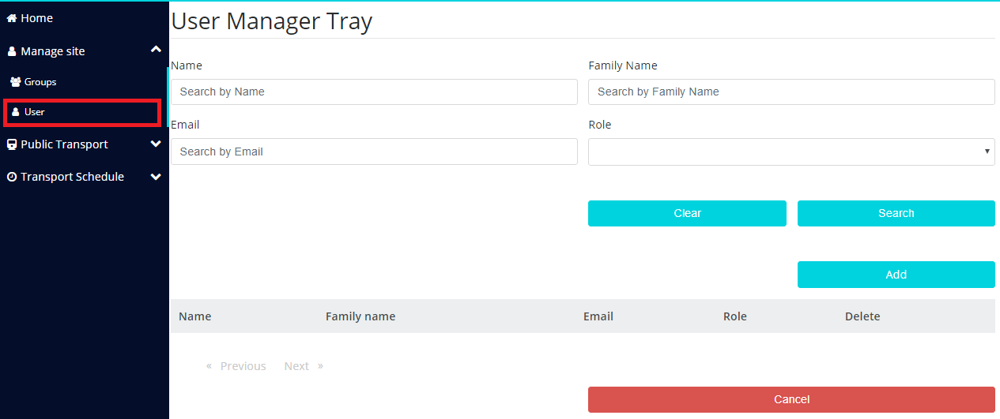

---
### 4.2.1 Public transport component
Green Route will show real data information about the public transport of the Mexico City. 
This information should be captured in this component. 
Firslty, it is possible to search a public transport using filters, such as: departure time, arrival time, route name and so on.
Green Route shows a list with the results.

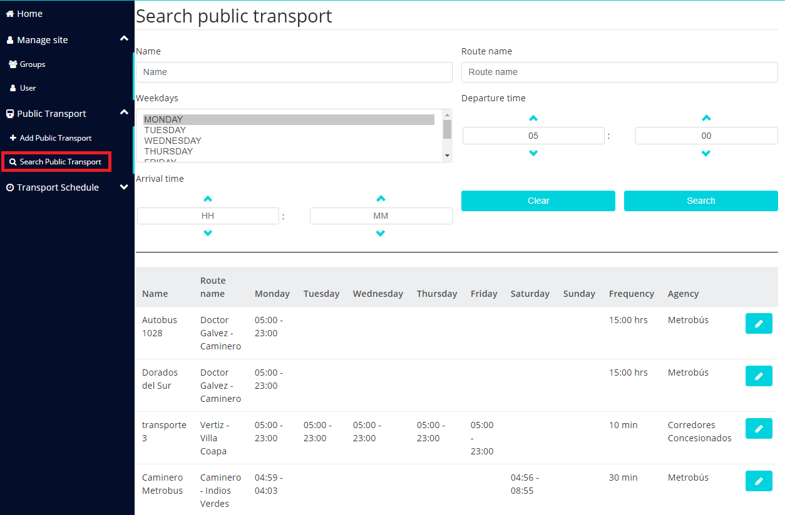

---
### 4.2.2 Add public transport
In this view, the manager adds information related to passengers total, name, fuel type and other information related the vehicle.
Also, the manager should add about the transport schedule. 

---
### 4.2.3 Transport schedule
For searching  transport schedule, Green Route presents a set of filters, such as agency, frequency of the public 
transport and route name. Green Route presents a list with the schedule for each day, the frequency and agency. 
The manager shoul press the button "Search Transport Schedule".

---
### 4.2.4 Add transport schedule
For adding, editing or updating a transport schedule, Green Route presents a view where the manager indicates
the route name, and the departure and arrival time for each day. In addition, the manager could indicates is the scheduleis actived or not.

Finally, the manager should indicate the frequency, agency, URL, timezone and language.

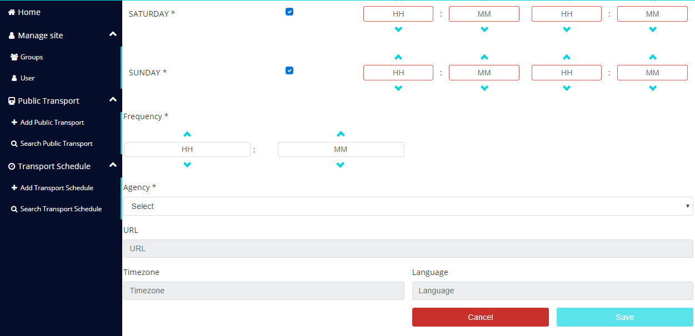

---
# 5. Green Route arquitecture
The current Smart City architecture consists of a set of modules that allows the final user 
to be able to find the best route to follow to reach a specific destination, based on distinctive
aspects that describe the user such as its profile (health conditions), preferences, transport 
type, etc. This architecture includes some of the components developed as part of the SmartSDK, 
such as: Smart Spot, Cloudino, and SDK library for NGSI.
 

If you want to deploy each component of the Green Route or you want to know more, we provide
 the links to access to more data to following.

## 5.1 Back End Green Route
The Back End component is the manager of all data traffic of Green Route. All the time, the 
graphic interface interacted with the Back End. This component has all the configurations, 
such as filters, connection to Mongo database, catalogs, identity management, and so on.

You can find the code of this component in GitHub: 
[Back End Green Route](https://github.com/R4chel83/smartcity-back). 

## 5.2 Front End Green Route
The Front End component contains all the user graphic interface of Green Route. In this 
components you can find all the css file. In addition, through of this interface the user 
can modify his user, vehicle and health profile, or a user can subscribe to groups.

You can find the code of this component in GitHub: 
[Front End Green Route](https://github.com/R4chel83/smartcity-front). 

## 5.3 Vagrant - keyrock Green Route
You can find a docker component that allow to deploy the services of Mongo database and 
Keyrock. For instances, all the alerts and user profile data are saved in Mongo. On the
other hand, the keyrock manages all the tokens to access to applications, services and users.  

You can find the code of this component in GitHub: 
[Vagrant - keyrock](https://github.com/R4chel83/vagrant-keyrock). 

## 5.4 Air Quality component
The Air Quality component fetches the information from all the stations that you could have
listed on Orion Context Broker. This stations must be modelled with the [Air Quality Observed 
Model from FIWARE ](http://fiware-datamodels.readthedocs.io/en/latest/Environment/AirQualityObserved/doc/spec/index.html). 
Each point is subscribed to the Broker so the data is updated in realtime. 
This component also able to find out how to calculate the Air Quality Index, so it can 
display some colors for each pollutant, when you click a given point.

You can find the code of this component in GitHub: 
[Air Quality component](https://github.com/ftcardoso/airQualityDemo). 

